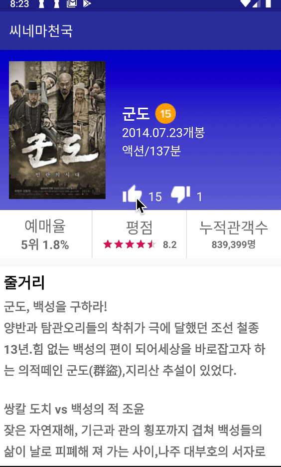

# [부스트코스 에이스] 안드로이드 프로그래밍

## 유의사항
- 학습 내용 작성시, 타 학생의 학습에 지장을 줄 수 있으므로 프로젝트 전체 소스코드 공유는 제한하며 학습 내용 중심으로 작성되어야 합니다. 
- 타인의 소스코드를 복제하여 제출하거나 다른 사람의 계정으로 제출하는 경우 적발시, 부스트코스 규정에 따라 에이스 권한이 박탈될수 있습니다.  

## PTJ2
1) 좋아요/싫어요 이미지를 터치했을 때 숫자가 바뀌고 이미지의 선택 상태도 바뀌어 표시되도록 합니다.

<pre>- 좋아요 이미지를 터치하면 좋아요 숫자가 1 증가하도록 하고, 선택 상태로 바뀌어 표시합니다.
- 싫어요 이미지를 터치하면 싫어요 숫자가 1 증가하도록 하고, 선택 상태로 바뀌어 표시합니다.
- 좋아요가 선택된 상태에서 싫어요 이미지를 터치하면 좋아요 숫자가 1 감소하고 좋아요 버튼이 미선택 상태로 바뀌게 합니다.
- 싫어요가 선택된 상태에서 좋아요 이미지를 터치하면 싫어요 숫자는 1 감소하고 싫어요 버튼이 미선택 상태로 바뀌게 합니다.</pre>
2) 한줄평을 리스트 형태로 보여줍니다.

3) 한줄평 ‘작성하기’와 ‘모두보기’ 버튼을 터치하면 토스트 메시지로 버튼이 눌렸음을 알려줍니다.

### 결과물


### 현업 개발자분 피드백
```java
<ImageView
android:layout_width="wrap_content"
android:layout_height="wrap_content"
android:layout_marginLeft="@dimen/small_margin"/>
```

>여백이나 위치를 조절하는 부분은 꼭 왼쪽이나 오른쪽에 있어야 하는 view가 아니라면 left /right 옵션을 사용하기보다는 Start 나 end 를 사용하시는 것을 추천 드립니다.
>RTL 설정된 화면에서 left / right 로만 view 를 컨트롤 할 경우 의도하지 않은 결과가 나올 때가 종종 있으나, Start 나 End 를 사용할 경우 이런 문제를 깔끔하게 해결 할 수 있습니다. 


***


## PTJ3
## PTJ4
## PTJ5
## PTJ6
## PTJ7
## PTJ8
